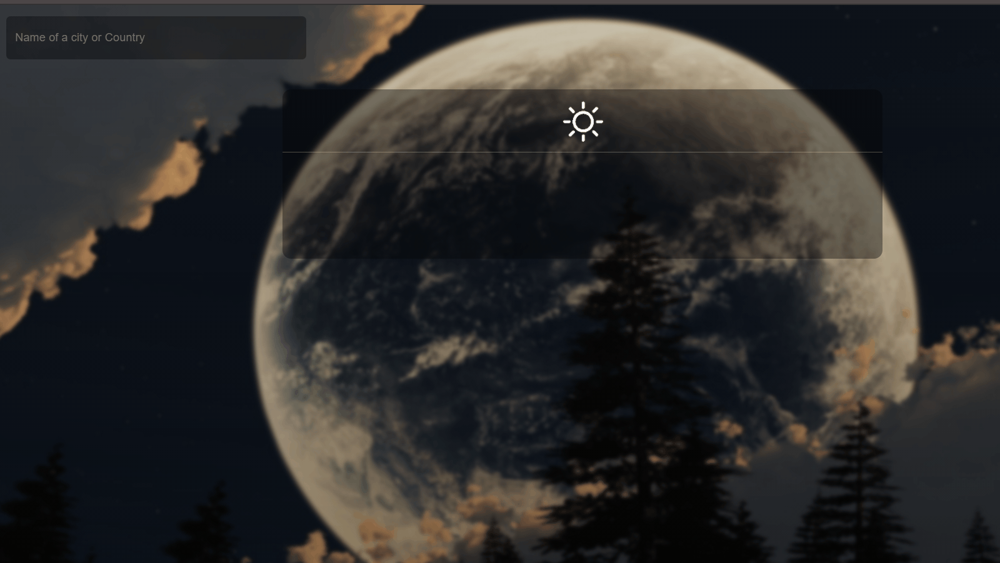

# Weather-App

Microverse project - Weather App

## Project features

- API Use example
- The Weather App project comes at the end of the Asynchronous Javascript and APIs section of the Javascript course. It tests the knowledge of the student about asynchronous communication with promises or async/await and when to use them.

## Live Demo Website

Click the following [link](https://vmweatherapp.netlify.app/) to see a live version of the site.

<br>

## Built With

- HTML
- CSS
- JavaScript
- API

#### To get this project on your local machine, follow these steps:

1. Run this command `https://github.com/vmwhoami/weather_app`in the desired folder to clone the repository on to your local machine. After cloning the project, you should move into the directory where the project is stored, for example`cd weatherApp`.

2. Then run the following command install the necessary dependencies

```bash
    npm install
```

- Run `npm run build` to have the necessary changes applied if you want to change anything in the codebase.

- Add create an .env file and add your API key in there as 'KEY'.
- To open run the 'index.html' with 'Live Server'.

## Author

👤 **Vitalie Melnic**

- Github: [@vmwhoami](https://github.com/vmwhoami)
- Twitter: [@vmwhoami](https://twitter.com/vmwhoami)
- Linkedin: [@vitalie-melnic](https://www.linkedin.com/in/vitalie-melnic/)

## Show your support

Give an ⭐️ if you like this project!

## Acknowledgments

- This project was originally taken from [The Odin project](https://www.theodinproject.com/courses/javascript/lessons/weather-app).
- The project was inspired by the [Microverse](https://www.microverse.org/) program.

## 📝 License

This project is [MIT](lic.url) licensed.
